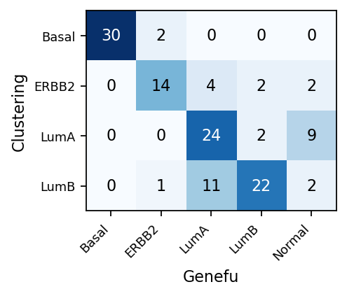
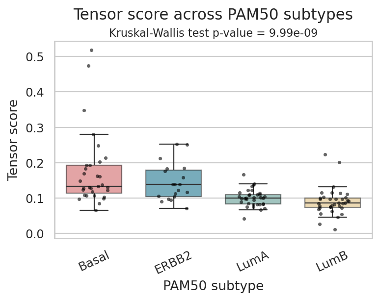
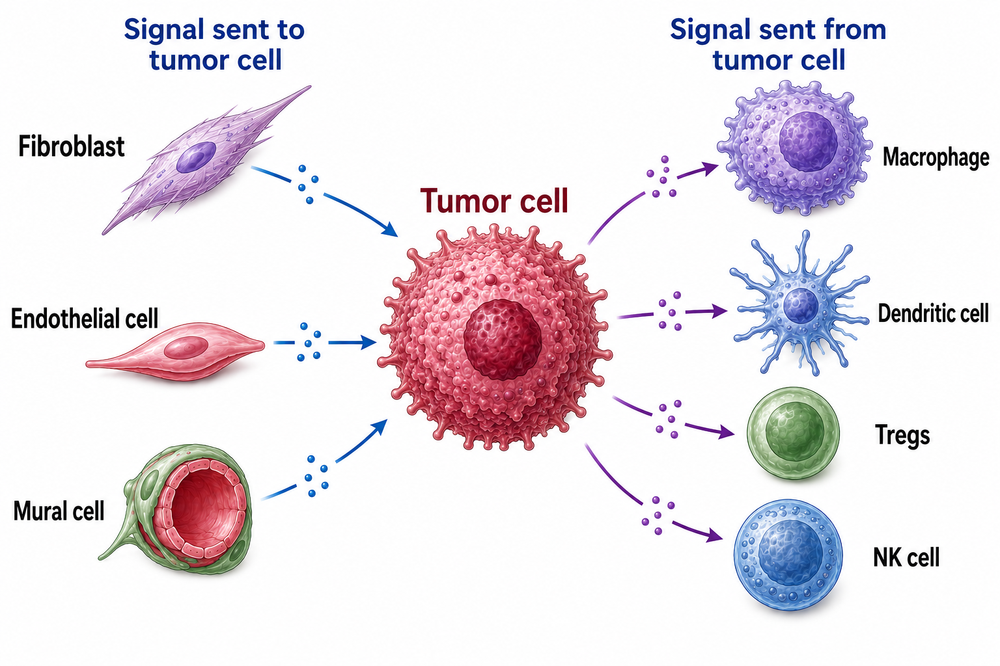
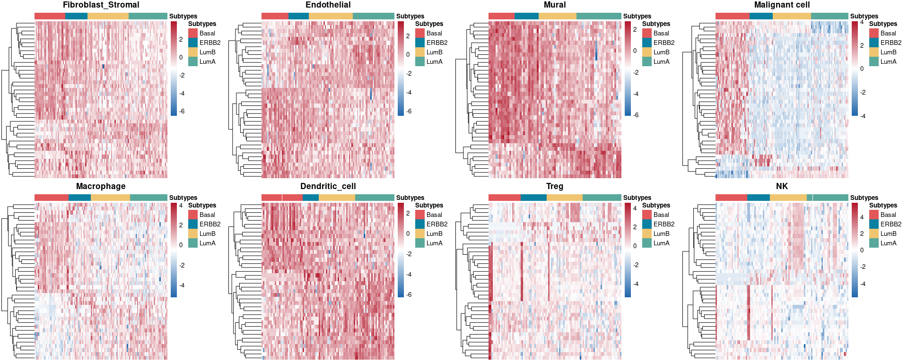

# Tumor-microenvironment communication in breast cancer single-cell RNA-seq


> **Anastasiia Sycheva** </br>
> tg: *@PenguinNell* </br>
> ansycheva26@gmail.com

**Supervisor**: Ivan Valiev

---

## About

A bioinformatics project investigating **tumor-microenvironment communication** across **breast cancer PAM50 subtypes** using single-cell RNA-seq data. 

The repository combines **Python** and **R** workflows, introduces a custom **RNA-seq-oriented subtype classification approach**, and provides a reproducible **CLI pipeline** for **LIANA + Tensor-cell2cell** analysis.

## Table of contents

- [Project goals and objectives](#project-goals-and-objectives)
- [Data](#data)
- [Repository structure](#repository-structure)
- [Analysis overview](#analysis-overview)
- [Results](#results)
  - [Part 1. Breast cancer subtype classification from tumor-cell pseudobulks](#part-1-breast-cancer-subtype-classification-from-tumor-cell-pseudobulks)
  - [Part 2. Tumor-microenvironment communication across PAM50 subtypes](#part-2-tumormicroenvironment-communication-across-pam50-subtypes)
  - [Part 3. Expression-level validation of subtype-associated communication patterns](#part-3-expression-level-validation-of-subtype-associated-communication-patterns)
- [Conclusions](#conclusions)
- [Reproducible CCC pipeline](#reproducible-ccc-pipeline)
- [Reproducibility and software environment](#reproducibility-and-software-environment)
- [References](#references)

## Project goals and objectives

The project explores subtype-specific features of the **breast cancer tumor microenvironment** using single-cell RNA-seq data. Its main aim is to determine whether **PAM50 breast cancer subtypes** differ not only in tumor-cell state, but also in tumor-microenvironment communication.

The analysis includes four key tasks:
- donor-level subtype assignment from tumor-cell pseudobulks;
- preparation of the single-cell atlas for communication analysis;
- inference of subtype-associated ligand-receptor programs with **LIANA + Tensor-cell2cell**;
- expression- and pathway-level validation using cell-type-specific pseudobulks.

## Data

This project is based on the public breast cancer atlas **“A single-cell and spatially resolved atlas of human breast cancers”** available via [CELLxGENE](https://cellxgene.cziscience.com/collections/9432ae97-4803-4b9f-8f64-2b41e42ad3cb).

The analyzed single-cell dataset includes **138 donors** and **621,200 cells**.

The original `.h5ad` input file is large and is **not stored in the repository**. It should be downloaded separately from the source collection before reproducing the analysis.

## Repository structure

- `notebooks/` - main analysis workflow
- `scripts/` - reusable Python and R scripts
- `data/` - generated intermediate files and reference resources used during the analysis
- `imgs/` - figures used in the README
- `requirements.txt` - Python dependencies

Large raw inputs and some intermediate files are not tracked in Git and must be downloaded or regenerated separately.

## Analysis overview

The full analysis can be reproduced in the following order:

1. `notebooks/01_breast_cancer_subtype_classification.ipynb`  
   donor-level subtype assignment from tumor-cell pseudobulks

2. `notebooks/02a_prep_data_pam50_for_liana.ipynb`  
   preparation of the single-cell atlas for communication analysis

3. `notebooks/02b_cell_cell_communication_analysis.ipynb`  
   LIANA + Tensor-cell2cell analysis of tumor-TME communication

4. `notebooks/03_dge_and_pathway_analysis.Rmd`  
   expression- and pathway-level validation

Alternatively, the communication analysis can be rerun via the standalone CLI pipeline:

```bash
python ccc_pipeline.py --help
```

## Results

### Part 1. Breast cancer subtype classification from tumor-cell pseudobulks

**What for:**  
This step assigns PAM50 subtypes to donors and compares a standard PAM50 classifier with an RNA-seq-oriented alternative better suited to pseudobulk expression profiles.

**Pipeline:**  
Malignant cells were extracted from the atlas and aggregated into donor-level tumor pseudobulks. After TMM + logCPM normalization, subtypes were assigned in two ways: (1) PAM50 classification with `genefu`, and (2) a custom clustering-based workflow using published subtype-discriminative gene panels to separate Basal, ERBB2, LumA, and LumB tumors.

**Results:**  
The custom workflow produced a four-class solution across donors: **Basal-like (32), ERBB2+ (22), Luminal A (35), Luminal B (36)**.  
Agreement with `genefu` was strongest for **Basal-like**, moderate for **ERBB2+**, and less stable for the **Luminal A / Luminal B** split, which is expected given their biological similarity. At the same time, the clustering-based approach gave a clearer separation of luminal samples in the expression heatmap.



**Takeaway:**  
Subtype labels were robust enough for downstream analysis, and the custom RNA-seq-oriented approach provided a biologically interpretable alternative to microarray-based PAM50 classification.

**Source:**
More details can be found here: [Subtype classification notebook](notebooks/01_breast_cancer_subtype_classification.ipynb)

### Part 2. Tumor-microenvironment communication across PAM50 subtypes

**What for:**  
This part tests whether breast cancer subtypes differ not only in tumor-cell state, but also in how tumor and microenvironment compartments communicate.

**Pipeline:**  
After filtering donors and merging cell annotations into major cell types, subtype labels were mapped back to single cells and the dataset was prepared for communication analysis. Donor-level ligand-receptor interactions were inferred with **LIANA**, restricted to **tumor -> TME** and **TME -> tumor** signaling, and then decomposed with **Tensor-cell2cell** to identify shared communication programs across donors. In parallel, cell-type-specific donor pseudobulks were generated for later expression-based validation.

**Results:**  
After filtering, **121 of 138 donors** were retained. Subtype-dependent differences in TME composition were detected in **9 of 15** non-malignant major cell types, indicating that PAM50 subtypes differ not only transcriptionally, but also in microenvironment structure.

Tensor-cell2cell identified **one dominant communication program** that captured most subtype-related variation. This factor was strongest in **Basal-like**, elevated in **ERBB2+**, and weaker in **Luminal A/B** tumors. The same trend remained significant after restricting to curated interactions.



Biologically, the program combined:
- a **stromal-to-tumor axis** involving Fibroblast/Stromal, Endothelial, and Mural cells;
- a **tumor-to-immune axis** involving signaling toward Macrophages, Dendritic cells, Treg, and NK cells.

Top interactions included **COL1A1/COL1A2 -> CD44**, **FN1 -> CD44**, and **MIF -> CD74/CXCR4**.



**Takeaway:**  
Breast cancer subtypes differ along a major tumor-TME communication gradient, with stronger stromal remodeling and immune-modulatory signaling in the more aggressive **Basal-like** and **ERBB2+** tumors.

**Source:**
This part was divided into two steps: data preparation and cell-cell communication analysis. Details can be found here:
- [CCC data preparation notebook](notebooks/02a_prep_data_pam50_for_liana.ipynb)
- [Cell-cell communication notebook](notebooks/02b_cell_cell_communication_analysis.ipynb)

### Part 3. Expression-level validation of subtype-associated communication patterns

**What for:**  
This step evaluates whether the communication patterns identified in Part 2 are also reflected in donor-level expression changes within specific cell compartments.

**Pipeline:**  
Cell-type-specific donor pseudobulks were analyzed in **R** using **edgeR** for differential expression across PAM50 subtypes. In addition, receptor-centered **Reactome** pathway scores were computed to test whether signaling programs highlighted by the CCC analysis were also altered at the transcriptional level.

**Results:**  
Subtype-associated expression differences were detected not only in malignant cells, but also in several TME compartments. In the cell types most strongly involved in the communication signal, the same broad pattern was observed as in Part 2: expression programs were generally higher in **Basal-like** and **ERBB2+** tumors and lower in **Luminal** subtypes.

Pathway analysis provided targeted support for this result. Significant subtype-associated differences were detected in:
- **Malignant cells**: stromal and inflammatory programs;
- **Macrophages**: inflammatory program.

These findings are consistent with the dominant CCC program, which linked a **stromal TME -> tumor axis** with a **tumor -> immune axis**.



**Takeaway:**  
The communication gradient identified by LIANA + Tensor-cell2cell is supported by independent expression- and pathway-level evidence, suggesting that PAM50 subtypes differ in both tumor state and tumor-microenvironment interaction programs.

**Source:**
More details on differential expression and pathway analysis can be found here: 
- [raw R Markdown](notebooks/03_dge_and_pathway_analysis.Rmd)
- [rendered HTML report](notebooks/03_dge_and_pathway_analysis.html)

## Conclusions

This project shows that **breast cancer PAM50 subtypes** differ not only in tumor-cell expression profiles, but also in the composition and communication structure of the **tumor microenvironment**.

Across the analyzed donors, the strongest communication signal was associated with a program combining:
- **stromal-to-tumor signaling**, linked to matrix remodeling and stromal interactions;
- **tumor-to-immune signaling**, linked to immune-modulatory communication.

This program was more active in **Basal-like** and **ERBB2+** tumors and weaker in **Luminal A/B** tumors. Importantly, the same broad subtype trend was supported by independent **cell-type-specific pseudobulk differential expression** and **pathway analysis**.

Overall, the results suggest that breast cancer subtype differences are reflected not only in intrinsic tumor-cell state, but also in broader tumor-microenvironment interaction programs.

## Reproducible CCC pipeline

This repository includes a standalone CLI pipeline, `ccc_pipeline.py`, for reproducible **LIANA + Tensor-cell2cell** analysis from an annotated `.h5ad` object.

The pipeline is designed specifically for **tumor microenvironment** analysis. It distinguishes **tumor** and **non-tumor** compartments, supports subtype-aware recurrence filtering, and allows communication to be restricted to specific directions such as **tumor -> TME** and **TME -> tumor** before tensor decomposition.

**Input requirements:**
- donor/sample annotation
- cell type annotation
- subtype annotation
- tumor cell label

**Supported interaction modes:**
- `tt` - tumor -> tumor
- `t_nt` - tumor -> non-tumor
- `nt_t` - non-tumor -> tumor
- `nt_nt` - non-tumor -> non-tumor

**Example**
```bash
python ccc_pipeline.py \
    --adata-path ../data/data_hgnc.h5ad \
    --outdir ../data/liana_tensor_cell2cell_result \
    --min-cells 20 \
    --expr-prop 0.2 \
    --min-donors-prop 0.4 \
    --tumor-label 'Malignant cell' \
    --subtype-col PAM50_subtype \
    --sample-col donor_id \
    --celltype-col cell_type_major \
    --interaction-mode 't_nt,nt_t' \
    --use-gpu
```

The pipeline saves donor-level LIANA results, filtered interaction tables, tensor objects, and decomposition outputs to the specified output directory.

For the full list of options:
```bash
python ccc_pipeline.py --help
```

## Reproducibility and software environment

The project combines **Python** and **R** workflows.

### Python environment

The Python analysis was performed with **Python 3.12**.

Install the base environment with:

```bash
uv pip install -r requirements.txt
```

The workflow can be reproduced on **CPU**, but some tensor decomposition steps were originally run on a **GPU-enabled server**.

To enable GPU acceleration, install a CUDA-compatible version of **PyTorch**. For example, for **CUDA 12.6**:

```bash
uv pip install --index-url https://download.pytorch.org/whl/cu126 torch
```

GPU support is mainly relevant for the tensor-based CCC step.

### R environment

The R workflow was tested with **R 4.6.0**.

R is required both for subtype classification and for downstream differential expression and pathway analysis.

Key R packages used across the project:

| Package | Version |
|---|---:|
| genefu | 4.8.2 |
| edgeR | 4.10.0 |
| limma | 3.68.3 |
| GSEABase | 1.74.0 |
| pheatmap | 1.0.13 |
| DT | 0.34.0 |
| gridExtra | 2.3 |
| patchwork | 1.3.2 |
| tidyverse | 2.0.0 |

Required R packages are installed automatically when running the analysis files:
- `tmm_logcpm_pam50_subtyping.R` for TMM + logCPM pseudobulk processing and PAM50 classification;
- `03_dge_and_pathway_analysis.Rmd` for differential expression, pathway analysis, and visualization.

## References

### Bibliography
1.	P. Turova et al., “The Breast Cancer Classifier refines molecular breast cancer classification to delineate the HER2-low subtype,” npj Breast Cancer, vol. 11, no. 1, p. 19, Feb. 2025.
2.	H. M. Baghdassarian, D. Dimitrov, E. Armingol, J. Saez-Rodriguez, and N. E. Lewis, “Combining LIANA and Tensor-cell2cell to decipher cell-cell communication across multiple samples,” Cell Rep Methods, vol. 4, no. 4, p. 100758, Apr. 2024.
3. D. Dimitrov et al., “Comparison of methods and resources for cell-cell communication inference from single-cell RNA-Seq data,” Nature Communications, vol. 13, no. 1, p. 3224, Jun. 2022.
4. E. Armingol et al., “Context-aware deconvolution of cell–cell communication with Tensor-cell2cell,” Nature Communications, vol. 13, no. 1, p. 3665, Jun. 2022.
5. J. S. Parker et al., “Supervised risk predictor of breast cancer based on intrinsic subtypes,” J Clin Oncol, vol. 27, no. 8, pp. 1160–1167, Mar. 2009.
6. M. Li et al., “Microenvironment remodeled by tumor and stromal cells elevates fibroblast-derived COL1A1 and facilitates ovarian cancer metastasis,” Exp Cell Res, vol. 394, no. 1, p. 112153, Sep. 2020.
7. B. Li et al., “Fibronectin 1 promotes melanoma proliferation and metastasis by inhibiting apoptosis and regulating EMT,” Onco Targets Ther, vol. 12, pp. 3207–3221, May 2019.
8. R. A. Youness et al., “Macrophage migration inhibitory factor (MIF) and the tumor ecosystem: a tale of inflammation, immune escape, and tumor growth,” Front. Immunol., vol. 16, p. 1636839, Oct. 2025.
9. A. W. Griffioen et al., “CD44 is involved in tumor angiogenesis; an activation antigen on human endothelial cells,” Blood, vol. 90, no. 3, pp. 1150–1159, Aug. 1997.
10. O. Chen et al., “Modulating tumor-associated macrophages through APP-CD74 blockade with IL4R-exosomes synergizes with PD-1 inhibition in gastric cancer,” NPJ Precis Oncol, Mar. 2026, doi: 10.1038/s41698-025-01268-y.
11. S. Z. Wu et al., “A single-cell and spatially resolved atlas of human breast cancers,” Nature Genetics, vol. 53, no. 9, pp. 1334–1347, Sep. 2021.
12. N. Harbeck et al., “Breast cancer,” Nature Reviews Disease Primers, vol. 5, no. 1, p. 66, Sep. 2019.
13. S. Jin, M. V. Plikus, and Q. Nie, “CellChat for systematic analysis of cell–cell communication from single-cell transcriptomics,” Nature Protocols, vol. 20, no. 1, pp. 180–219, Sep. 2024.

### Databases

1. A single-cell and spatially resolved atlas of human breast cancers: https://cellxgene.cziscience.com/collections/9432ae97-4803-4b9f-8f64-2b41e42ad3cb
2. CellChatDB: https://github.com/sqjin/CellChat
3. Reactome Pathway Database: https://www.gsea-msigdb.org/gsea/msigdb/cards/REACTOME_TRANSLATION

## License

This repository is distributed under the MIT License.