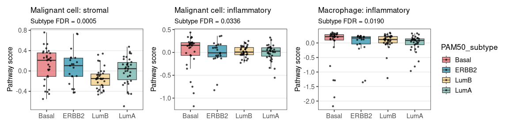

Differential expression and pathway analysis across PAM50 subtypes
================

- [Differential gene expression (DGE)
  analysis](#differential-gene-expression-dge-analysis)
  - [Load pseudobulks and sample
    metadata](#load-pseudobulks-and-sample-metadata)
  - [Donor coverage](#donor-coverage)
  - [Differential expression by cell
    type](#differential-expression-by-cell-type)
  - [DGE summary](#dge-summary)
  - [Generate heatmaps of top differentially expressed
    genes](#generate-heatmaps-of-top-differentially-expressed-genes)
  - [Cell types involved in the highest-scoring
    interactions](#cell-types-involved-in-the-highest-scoring-interactions)
- [Receptor-centered Reactome pathway
  analysis](#receptor-centered-reactome-pathway-analysis)
  - [Load Reactome gene sets](#load-reactome-gene-sets)
  - [Select pathway sets for downstream
    scoring](#select-pathway-sets-for-downstream-scoring)
  - [Test pathway-score differences across PAM50
    subtypes](#test-pathway-score-differences-across-pam50-subtypes)
  - [Pathway-score plots](#pathway-score-plots)
- [Summary](#summary)

``` r
cran_packages <- c(
  'pheatmap',
  'DT',
  'gridExtra',
  'patchwork',
  'tidyverse'
)

bioc_packages <- c(
  'BiocManager',
  'edgeR',
  'limma',
  'GSEABase'
)

for (pkg in cran_packages) {
  if (!requireNamespace(pkg, quietly = TRUE)) {
    install.packages(pkg)
  }
}

if (!requireNamespace('BiocManager', quietly = TRUE)) {
  install.packages('BiocManager')
}

for (pkg in bioc_packages[bioc_packages != 'BiocManager']) {
  if (!requireNamespace(pkg, quietly = TRUE)) {
    BiocManager::install(pkg, ask = FALSE, update = FALSE)
  }
}

library(edgeR)
library(limma)
library(pheatmap)
library(DT)
library(gridExtra)
library(grid)
library(GSEABase)
library(patchwork)
library(tidyverse)
```

``` r
subtype_levels <- c('Basal', 'ERBB2', 'LumA', 'LumB')

subtype_colors <- c(
  'Basal' = '#e25759',
  'ERBB2' = '#0b81a2',
  'LumB'  = '#f0c571',
  'LumA'  = '#59a89c'
)

heatmap_palette <- colorRampPalette(c('#2166AC', 'white', '#B2182B'))(100)
```

## Differential gene expression (DGE) analysis

This part study whether PAM50 subtypes differ in donor-level expression
within each major cell type.

Expression is analyzed on pseudobulk profiles, where each sample is one
donor × cell type combination. This keeps the comparison at the donor
level and makes it directly comparable to the previous CCC analysis.

### Load pseudobulks and sample metadata

The pseudobulk count matrix and sample metadata with PAM50 subtype and
batch labels were prepared in Part 2a. After preprocessing, the dataset
contains 121 donors and 26 052 genes.

``` r
pseudobulks <- read.csv(
  '../data/pseudobulks_all_cell_types/pseudobulks_all_cell_types_counts_gene_by_sample.tsv',
  sep = '\t',
  header = TRUE,
  row.names = 1
) %>%
  t()

samples_meta <- read.csv(
  '../data/pseudobulks_all_cell_types/pseudobulks_all_cell_types_sample_subtype_batch_metadata.tsv',
  sep = '\t',
  header = TRUE
) %>%
  mutate(
    PAM50_subtype = factor(PAM50_subtype, levels = subtype_levels),
    batch = factor(batch)
  )

cat('Counts dim (genes x samples):', paste(dim(pseudobulks), collapse = ' x '))
```

    ## Counts dim (genes x samples): 26052 x 1374

### Donor coverage

Before testing, I check donor coverage across subtypes within each cell
type, because cell types with too few donors are not suitable for stable
donor-level comparison.

``` r
donors_per_cell_type <- samples_meta %>%
  distinct(donor_id, PAM50_subtype, cell_type_major) %>%
  mutate(denom = n_distinct(donor_id), .by = PAM50_subtype) %>%
  count(PAM50_subtype, cell_type_major, denom, name = 'n') %>%
  mutate(val = sprintf('%d (%.0f%%)', n, 100 * n / denom)) %>%
  select(-n, -denom) %>%
  pivot_wider(
    names_from = PAM50_subtype,
    values_from = val,
    values_fill = '0 (0%)'
  )

datatable(donors_per_cell_type, options = list(paging = FALSE))
```

<div class="datatables html-widget html-fill-item" id="htmlwidget-d60cf1d78ea8a0010385" style="width:100%;height:auto;"></div>
<script type="application/json" data-for="htmlwidget-d60cf1d78ea8a0010385">{"x":{"filter":"none","vertical":false,"data":[["1","2","3","4","5","6","7","8","9","10","11","12","13","14","15","16"],["B_memory","CD4_Tconv","CD8_T","Dendritic_cell","Endothelial","Exhausted_T","Fibroblast_Stromal","Macrophage","Malignant cell","Mast","Mural","NK","Naive_T","Plasma","Tfh","Treg"],["17 (55%)","17 (55%)","20 (65%)","28 (90%)","20 (65%)","20 (65%)","26 (84%)","30 (97%)","31 (100%)","2 (6%)","15 (48%)","22 (71%)","19 (61%)","18 (58%)","18 (58%)","23 (74%)"],["13 (62%)","15 (71%)","17 (81%)","11 (52%)","15 (71%)","10 (48%)","19 (90%)","20 (95%)","21 (100%)","4 (19%)","14 (67%)","16 (76%)","15 (71%)","14 (67%)","12 (57%)","19 (90%)"],["24 (71%)","31 (91%)","29 (85%)","27 (79%)","31 (91%)","12 (35%)","33 (97%)","33 (97%)","34 (100%)","13 (38%)","26 (76%)","29 (85%)","25 (74%)","20 (59%)","13 (38%)","28 (82%)"],["21 (60%)","22 (63%)","28 (80%)","25 (71%)","33 (94%)","17 (49%)","35 (100%)","35 (100%)","35 (100%)","13 (37%)","22 (63%)","26 (74%)","26 (74%)","21 (60%)","20 (57%)","26 (74%)"]],"container":"<table class=\"display\">\n  <thead>\n    <tr>\n      <th> <\/th>\n      <th>cell_type_major<\/th>\n      <th>Basal<\/th>\n      <th>ERBB2<\/th>\n      <th>LumA<\/th>\n      <th>LumB<\/th>\n    <\/tr>\n  <\/thead>\n<\/table>","options":{"paging":false,"columnDefs":[{"orderable":false,"targets":0},{"name":" ","targets":0},{"name":"cell_type_major","targets":1},{"name":"Basal","targets":2},{"name":"ERBB2","targets":3},{"name":"LumA","targets":4},{"name":"LumB","targets":5}],"order":[],"autoWidth":false,"orderClasses":false}},"evals":[],"jsHooks":[]}</script>

Only Mast cells have insufficient coverage and are excluded from
downstream analysis.

``` r
samples_meta <- samples_meta %>%
  filter(cell_type_major != 'Mast')

pseudobulks <- pseudobulks[, samples_meta$sample_id, drop = FALSE]
```

### Differential expression by cell type

Differential expression is tested separately for each major cell type
using `edgeR` quasi-likelihood models.

The main effect of interest is PAM50 subtype; batch is included when the
design is estimable.

The reported statistics calculated using a quasi-likelihood F-test
(`edgeR`), performed separately within each major cell type across PAM50
subtype contrasts.

This step also includes code to generate logCPM matrices for downstream
heatmap visualization.

``` r
deg_results <- list()

for (ct in unique(samples_meta$cell_type_major)) {
  meta_ct <- samples_meta %>%
    filter(cell_type_major == ct)

  counts_ct <- pseudobulks[, meta_ct$sample_id, drop = FALSE]

  design_subtype <- model.matrix(~ 0 + PAM50_subtype, data = meta_ct)
  colnames(design_subtype) <- gsub('^PAM50_subtype', '', colnames(design_subtype))

  design_full <- model.matrix(~ 0 + PAM50_subtype + batch, data = meta_ct)

  if (qr(design_full)$rank == ncol(design_full)) {
    design <- design_full
    colnames(design) <- colnames(design) %>%
      gsub('^PAM50_subtype', '', .) %>%
      gsub('^batch', '', .)
    batch_in_model <- TRUE
  } else {
    design <- design_subtype
    batch_in_model <- FALSE
  }

  y <- DGEList(counts = counts_ct, samples = meta_ct)
  y <- y[filterByExpr(y, design = design, group = meta_ct$PAM50_subtype), , keep.lib.sizes = FALSE]
  y <- normLibSizes(y, method = 'TMM')
  y <- estimateDisp(y, design, robust = TRUE)
  fit <- glmQLFit(y, design, robust = TRUE)

  present_subtypes <- colnames(design_subtype)
  reference_subtype <- 'LumA'
  tested_subtypes <- setdiff(present_subtypes, reference_subtype)

  contrast_mat <- matrix(
    0,
    nrow = ncol(design),
    ncol = length(tested_subtypes),
    dimnames = list(
      colnames(design),
      paste0(tested_subtypes, '_vs_', reference_subtype)
    )
  )

  for (st in tested_subtypes) {
    contrast_mat[st, paste0(st, '_vs_', reference_subtype)] <- 1
    contrast_mat[reference_subtype, paste0(st, '_vs_', reference_subtype)] <- -1
  }

  qlf <- glmQLFTest(fit, contrast = contrast_mat)
  deg_table <- topTags(qlf, n = Inf)$table %>%
    rownames_to_column('gene')

  logcpm <- cpm(y, log = TRUE, prior.count = 1)

  logcpm_plot <- if (batch_in_model) {
    removeBatchEffect(
      logcpm,
      batch = meta_ct$batch,
      design = model.matrix(~ 0 + PAM50_subtype, data = meta_ct)
    )
  } else {
    logcpm
  }

  deg_results[[ct]] <- list(
    deg_omnibus_res = deg_table,
    deg_omnibus_top = deg_table %>% arrange(FDR, desc(F)) %>% slice_head(n = 20),
    n_sig = sum(deg_table$FDR < 0.05),
    logcpm = logcpm,
    logcpm_plot = logcpm_plot,
    meta = meta_ct
  )
}
```

### DGE summary

This table summarizes how many genes vary by subtype in each cell
type.  
It highlights which compartments carry the strongest subtype-associated
transcriptional signal.

``` r
deg_summary <- bind_rows(lapply(names(deg_results), function(ct) {
  deg_table <- deg_results[[ct]]$deg_omnibus_res

  data.frame(
    cell_type = ct,
    n_genes_fdr_0.005 = sum(deg_table$FDR < 0.005),
    n_genes_fdr_0.01  = sum(deg_table$FDR < 0.01),
    n_genes_fdr_0.05  = sum(deg_table$FDR < 0.05),
    top5_genes = paste(
      deg_table %>%
        arrange(FDR, desc(F)) %>%
        slice_head(n = 5) %>%
        pull(gene),
      collapse = ', '
    )
  )
})) %>%
  arrange(desc(n_genes_fdr_0.005))

datatable(deg_summary, options = list(paging = FALSE))
```

<div class="datatables html-widget html-fill-item" id="htmlwidget-ffedf4095195ca34da27" style="width:100%;height:auto;"></div>
<script type="application/json" data-for="htmlwidget-ffedf4095195ca34da27">{"x":{"filter":"none","vertical":false,"data":[["1","2","3","4","5","6","7","8","9","10","11","12","13","14","15"],["Malignant cell","Fibroblast_Stromal","Mural","Macrophage","CD4_Tconv","Endothelial","Treg","NK","Tfh","CD8_T","Exhausted_T","B_memory","Plasma","Dendritic_cell","Naive_T"],[6690,616,443,406,156,144,140,78,70,49,47,36,25,23,13],[7406,803,629,509,240,252,192,114,117,77,71,46,35,43,15],[9493,1648,1355,904,606,734,463,294,298,206,200,101,70,112,57],["MOXD1, MARCO, DLX5, PRSS12, HORMAD1","IGHG4, ZNF90, RRM2, SCN7A, UPP1","TIMP1, ADAMTS14, TSPAN15, IBSP, ADAMTS2","MT1F, MT1H, AGR3, ANKRD30A, CXCL5","AGR2, SCGB2A2, ENDOG, RBM38, CDV3","MFAP5, IGHM, PLEK2, MUCL1, ERBB2","CSTF1, FLCN, AGR2, NR2C2AP, TRPV2","MUCL1, CDV3, RABGGTA, AKT1, ARL4C","MUCL1, GPR25, TRAV38.2DV8, CDV3, EPC2","AKT1, RABGGTA, DCAF10, RABL6, NGRN","ENDOD1, MUCL1, ABCC1, MAPKAP1, SCGB2A2","ENDOD1, AGR2, FLCN, CBFA2T3, PRKAB1","CTCF, MFGE8, IGKV3.7, RBM23, ANKRD30A","MMP12, MUCL1, HBB, PPM1N, AGR2","MAPRE1, ILK, CXCL13, NGRN, ATXN10"]],"container":"<table class=\"display\">\n  <thead>\n    <tr>\n      <th> <\/th>\n      <th>cell_type<\/th>\n      <th>n_genes_fdr_0.005<\/th>\n      <th>n_genes_fdr_0.01<\/th>\n      <th>n_genes_fdr_0.05<\/th>\n      <th>top5_genes<\/th>\n    <\/tr>\n  <\/thead>\n<\/table>","options":{"paging":false,"columnDefs":[{"className":"dt-right","targets":[2,3,4]},{"orderable":false,"targets":0},{"name":" ","targets":0},{"name":"cell_type","targets":1},{"name":"n_genes_fdr_0.005","targets":2},{"name":"n_genes_fdr_0.01","targets":3},{"name":"n_genes_fdr_0.05","targets":4},{"name":"top5_genes","targets":5}],"order":[],"autoWidth":false,"orderClasses":false}},"evals":[],"jsHooks":[]}</script>

### Generate heatmaps of top differentially expressed genes

For each cell type, I save a plot with the top subtype-associated genes
as row-scaled logCPM to visualize whether samples organize by subtype in
a way that matches the formal tests.

``` r
dir.create('../imgs/heatmaps', recursive = TRUE, showWarnings = FALSE)

for (ct in names(deg_results)) {
  res_ct <- deg_results[[ct]]
  deg_table <- res_ct$deg_omnibus_res
  meta_ct <- res_ct$meta %>%
    mutate(PAM50_subtype = factor(PAM50_subtype, levels = c('Basal', 'ERBB2', 'LumB', 'LumA')))

  heat_genes <- deg_table %>%
    filter(FDR < 0.05) %>%
    arrange(FDR, desc(F)) %>%
    slice_head(n = 40) %>%
    pull(gene)

  if (length(heat_genes) == 0) {
    heat_genes <- deg_table %>%
      arrange(PValue) %>%
      slice_head(n = 40) %>%
      pull(gene)
  }

  heat_mat <- res_ct$logcpm_plot[heat_genes, meta_ct$sample_id, drop = FALSE]
  heat_mat <- t(scale(t(heat_mat)))
  heat_mat[is.na(heat_mat)] <- 0

  ann_col <- data.frame(Subtypes = meta_ct$PAM50_subtype, row.names = meta_ct$sample_id)
  order_idx <- order(meta_ct$PAM50_subtype, meta_ct$donor_id)
  ct_file <- gsub('[^A-Za-z0-9_]+', '_', ct)

  png(
    filename = file.path('../imgs/heatmaps', paste0(ct_file, '_heatmap.png')),
    width = 1300,
    height = 1100,
    res = 200
  )

  pheatmap(
    heat_mat[, order_idx, drop = FALSE],
    annotation_col = ann_col[order_idx, , drop = FALSE],
    annotation_colors = list(Subtypes = subtype_colors),
    show_colnames = FALSE,
    show_rownames = FALSE,
    cluster_cols = FALSE,
    cluster_rows = nrow(heat_mat) >= 2,
    border_color = NA,
    color = heatmap_palette,
    main = ct
  )

  dev.off()
}
```

### Cell types involved in the highest-scoring interactions

For this report, I focused on the cell types that contributed most
strongly to the top CCC interactions: (`Fibroblast_Stromal`,
`Endothelial`, `Mural`) -\> (`Malignant cell`) -\> (`Macrophage`,
`Dendritic_cell`, `Treg`, `NK`).

``` r
ct_panel <- c(
  'Fibroblast_Stromal',
  'Endothelial',
  'Mural',
  'Malignant cell',
  'Macrophage',
  'Dendritic_cell',
  'Treg',
  'NK'
)

heatmap_grobs <- list()

for (ct in ct_panel) {
  res_ct <- deg_results[[ct]]
  deg_table <- res_ct$deg_omnibus_res
  meta_ct <- res_ct$meta %>%
    mutate(PAM50_subtype = factor(PAM50_subtype, levels = c('Basal', 'ERBB2', 'LumB', 'LumA')))

  heat_genes <- deg_table %>%
    filter(FDR < 0.05) %>%
    arrange(FDR, desc(F)) %>%
    slice_head(n = 40) %>%
    pull(gene)

  if (length(heat_genes) == 0) {
    heat_genes <- deg_table %>%
      arrange(PValue) %>%
      slice_head(n = 40) %>%
      pull(gene)
  }

  heat_mat <- res_ct$logcpm_plot[heat_genes, meta_ct$sample_id, drop = FALSE]
  heat_mat <- t(scale(t(heat_mat)))
  heat_mat[is.na(heat_mat)] <- 0

  ann_col <- data.frame(Subtypes = meta_ct$PAM50_subtype, row.names = meta_ct$sample_id)
  order_idx <- order(meta_ct$PAM50_subtype, meta_ct$donor_id)

  p <- pheatmap(
    heat_mat[, order_idx, drop = FALSE],
    annotation_col = ann_col[order_idx, , drop = FALSE],
    annotation_colors = list(Subtypes = subtype_colors),
    show_colnames = FALSE,
    show_rownames = FALSE,
    cluster_cols = FALSE,
    cluster_rows = nrow(heat_mat) >= 2,
    border_color = NA,
    color = heatmap_palette,
    main = ct,
    silent = TRUE
  )

  heatmap_grobs[[ct]] <- p$gtable
}

grid.arrange(grobs = heatmap_grobs, nrow = 2, ncol = 4)
```


Across these cell types, expression follows a broad gradient from
Basal/ERBB2 toward Luminal subtypes, consistent with the CCC result
where the dominant communication program is strongest in Basal and ERBB2
tumors.

## Receptor-centered Reactome pathway analysis

To validate the communication programs suggested by the CCC analysis, I
tested whether the activity of the corresponding signaling pathways
differs across PAM50 subtypes. Pathway analysis was performed in a
receptor-centered framework, because the expected downstream response
should be detectable in the receiving cell type.

### Load Reactome gene sets

Reactome gene sets are loaded from `MSigDB` and filtered based on
receptors highlighted by the CCC analysis.

``` r
gmt <- getGmt('../data/MSigDB_collections/c2.cp.reactome.v2026.1.Hs.symbols.gmt')
gene_sets <- geneIds(gmt)
```

### Select pathway sets for downstream scoring

I restricted the analysis to pathway sets linked to receptors found by
the CCC analysis to test whether cells from different PAM50 subtypes
differ in the expression of other genes associated with the same pathway
group. This would support subtype-related differences in pathway
activity beyond the ligand-receptor pairs.

#### TME -\> Tumor

For TME -\> Tumor signaling, the target population is the malignant
compartment and the most abundant receptors are CD44 and CD74.

``` r
lr_tme_to_tumor <- c('CD44', 'CD74')

selected_sets_any_tme_to_tumor <- gene_sets[
  sapply(gene_sets, function(x) any(lr_tme_to_tumor %in% x))
]

names(selected_sets_any_tme_to_tumor)
```

    ##  [1] "REACTOME_ADAPTIVE_IMMUNE_SYSTEM"                                         
    ##  [2] "REACTOME_CELL_SURFACE_INTERACTIONS_AT_THE_VASCULAR_WALL"                 
    ##  [3] "REACTOME_CYTOKINE_SIGNALING_IN_IMMUNE_SYSTEM"                            
    ##  [4] "REACTOME_DEGRADATION_OF_THE_EXTRACELLULAR_MATRIX"                        
    ##  [5] "REACTOME_DEVELOPMENTAL_CELL_LINEAGES"                                    
    ##  [6] "REACTOME_DEVELOPMENTAL_CELL_LINEAGES_OF_THE_EXOCRINE_PANCREAS"           
    ##  [7] "REACTOME_DEVELOPMENTAL_CELL_LINEAGES_OF_THE_INTEGUMENTARY_SYSTEM"        
    ##  [8] "REACTOME_DEVELOPMENTAL_LINEAGES_OF_THE_MAMMARY_GLAND"                    
    ##  [9] "REACTOME_DEVELOPMENTAL_LINEAGE_OF_MAMMARY_GLAND_LUMINAL_EPITHELIAL_CELLS"
    ## [10] "REACTOME_DEVELOPMENTAL_LINEAGE_OF_MAMMARY_GLAND_MYOEPITHELIAL_CELLS"     
    ## [11] "REACTOME_DEVELOPMENTAL_LINEAGE_OF_MAMMARY_STEM_CELLS"                    
    ## [12] "REACTOME_DEVELOPMENTAL_LINEAGE_OF_PANCREATIC_DUCTAL_CELLS"               
    ## [13] "REACTOME_EXTRACELLULAR_MATRIX_ORGANIZATION"                              
    ## [14] "REACTOME_GLYCOSAMINOGLYCAN_METABOLISM"                                   
    ## [15] "REACTOME_HEMOSTASIS"                                                     
    ## [16] "REACTOME_HYALURONAN_DEGRADATION"                                         
    ## [17] "REACTOME_HYALURONAN_METABOLISM"                                          
    ## [18] "REACTOME_INNATE_IMMUNE_SYSTEM"                                           
    ## [19] "REACTOME_INTEGRIN_CELL_SURFACE_INTERACTIONS"                             
    ## [20] "REACTOME_INTERFERON_GAMMA_SIGNALING"                                     
    ## [21] "REACTOME_INTERFERON_SIGNALING"                                           
    ## [22] "REACTOME_METABOLISM_OF_CARBOHYDRATES_AND_CARBOHYDRATE_DERIVATIVES"       
    ## [23] "REACTOME_MHC_CLASS_II_ANTIGEN_PRESENTATION"                              
    ## [24] "REACTOME_NEUTROPHIL_DEGRANULATION"

These pathways can be grouped into two interpretable programs:

1.  **Stromal-contact program** — matrix organization, adhesion, and
    tissue interaction, mainly reflecting signals such as
    `COL1A1/COL1A2/FN1 -> CD44`.  
2.  **Inflammatory program** — cytokine/interferon-related signaling
    associated with `APP -> CD74` and `MIF -> CD44_CD74`.

Because Reactome terms are nested, I keep the more specific sets for
scoring.

``` r
stromal_program <- c(
  'REACTOME_EXTRACELLULAR_MATRIX_ORGANIZATION',
  'REACTOME_DEGRADATION_OF_THE_EXTRACELLULAR_MATRIX',
  'REACTOME_INTEGRIN_CELL_SURFACE_INTERACTIONS',
  'REACTOME_CELL_SURFACE_INTERACTIONS_AT_THE_VASCULAR_WALL',
  'REACTOME_HYALURONAN_METABOLISM',
  'REACTOME_HYALURONAN_DEGRADATION'
)

inflammatory_program <- c(
  'REACTOME_CYTOKINE_SIGNALING_IN_IMMUNE_SYSTEM',
  'REACTOME_INTERFERON_SIGNALING',
  'REACTOME_INTERFERON_GAMMA_SIGNALING',
  'REACTOME_MHC_CLASS_II_ANTIGEN_PRESENTATION'
)

stromal_gene_set <- unique(unlist(gene_sets[stromal_program]))
inflammatory_gene_set <- unique(unlist(gene_sets[inflammatory_program]))
```

#### Tumor -\> TME

For Tumor -\> TME signaling, I analyze Macrophage, Dendritic_cell, Treg,
and NK cells. Here the focus is on receptor-linked programs associated
with CD44, CD74, and CXCR4, which repeatedly detected in the strongest
tumor-derived interactions.

``` r
lr_tumor_to_tme <- c('CD44', 'CD74', 'CXCR4')

selected_sets_any_tumor_to_tme <- gene_sets[
  sapply(gene_sets, function(x) any(lr_tumor_to_tme %in% x))
]

names(selected_sets_any_tumor_to_tme)
```

    ##  [1] "REACTOME_ADAPTIVE_IMMUNE_SYSTEM"                                          
    ##  [2] "REACTOME_CELL_SURFACE_INTERACTIONS_AT_THE_VASCULAR_WALL"                  
    ##  [3] "REACTOME_CHEMOKINE_RECEPTORS_BIND_CHEMOKINES"                             
    ##  [4] "REACTOME_CLASS_A_1_RHODOPSIN_LIKE_RECEPTORS"                              
    ##  [5] "REACTOME_CYTOKINE_SIGNALING_IN_IMMUNE_SYSTEM"                             
    ##  [6] "REACTOME_DEGRADATION_OF_THE_EXTRACELLULAR_MATRIX"                         
    ##  [7] "REACTOME_DEVELOPMENTAL_CELL_LINEAGES"                                     
    ##  [8] "REACTOME_DEVELOPMENTAL_CELL_LINEAGES_OF_THE_EXOCRINE_PANCREAS"            
    ##  [9] "REACTOME_DEVELOPMENTAL_CELL_LINEAGES_OF_THE_INTEGUMENTARY_SYSTEM"         
    ## [10] "REACTOME_DEVELOPMENTAL_LINEAGES_OF_THE_MAMMARY_GLAND"                     
    ## [11] "REACTOME_DEVELOPMENTAL_LINEAGE_OF_MAMMARY_GLAND_LUMINAL_EPITHELIAL_CELLS" 
    ## [12] "REACTOME_DEVELOPMENTAL_LINEAGE_OF_MAMMARY_GLAND_MYOEPITHELIAL_CELLS"      
    ## [13] "REACTOME_DEVELOPMENTAL_LINEAGE_OF_MAMMARY_STEM_CELLS"                     
    ## [14] "REACTOME_DEVELOPMENTAL_LINEAGE_OF_MULTIPOTENT_PANCREATIC_PROGENITOR_CELLS"
    ## [15] "REACTOME_DEVELOPMENTAL_LINEAGE_OF_PANCREATIC_DUCTAL_CELLS"                
    ## [16] "REACTOME_EARLY_PHASE_OF_HIV_LIFE_CYCLE"                                   
    ## [17] "REACTOME_EXTRACELLULAR_MATRIX_ORGANIZATION"                               
    ## [18] "REACTOME_FORMATION_OF_DEFINITIVE_ENDODERM"                                
    ## [19] "REACTOME_GASTRULATION"                                                    
    ## [20] "REACTOME_GLYCOSAMINOGLYCAN_METABOLISM"                                    
    ## [21] "REACTOME_GPCR_LIGAND_BINDING"                                             
    ## [22] "REACTOME_G_ALPHA_I_SIGNALLING_EVENTS"                                     
    ## [23] "REACTOME_HEMOSTASIS"                                                      
    ## [24] "REACTOME_HIV_INFECTION"                                                   
    ## [25] "REACTOME_HIV_LIFE_CYCLE"                                                  
    ## [26] "REACTOME_HYALURONAN_DEGRADATION"                                          
    ## [27] "REACTOME_HYALURONAN_METABOLISM"                                           
    ## [28] "REACTOME_INFECTIOUS_DISEASE"                                              
    ## [29] "REACTOME_INNATE_IMMUNE_SYSTEM"                                            
    ## [30] "REACTOME_INTEGRIN_CELL_SURFACE_INTERACTIONS"                              
    ## [31] "REACTOME_INTERFERON_GAMMA_SIGNALING"                                      
    ## [32] "REACTOME_INTERFERON_SIGNALING"                                            
    ## [33] "REACTOME_METABOLISM_OF_CARBOHYDRATES_AND_CARBOHYDRATE_DERIVATIVES"        
    ## [34] "REACTOME_MHC_CLASS_II_ANTIGEN_PRESENTATION"                               
    ## [35] "REACTOME_NERVOUS_SYSTEM_DEVELOPMENT"                                      
    ## [36] "REACTOME_NEUTROPHIL_DEGRANULATION"                                        
    ## [37] "REACTOME_PEPTIDE_LIGAND_BINDING_RECEPTORS"                                
    ## [38] "REACTOME_REPRODUCTION"                                                    
    ## [39] "REACTOME_SIGNALING_BY_GPCR"                                               
    ## [40] "REACTOME_SIGNALING_BY_ROBO_RECEPTORS"                                     
    ## [41] "REACTOME_SPECIFICATION_OF_PRIMORDIAL_GERM_CELLS"                          
    ## [42] "REACTOME_VIRAL_INFECTION_PATHWAYS"

These pathways are grouped into three themes:

1.  **Inflammatory / immune-response program**  
2.  **Homing / positioning program**  
3.  **Adhesion / matrix-sensing program**

In the inflammatory program `REACTOME_MHC_CLASS_II_ANTIGEN_PRESENTATION`
is relevant only for myeloid cells.

``` r
infl_myel_program <- c(
  'REACTOME_CYTOKINE_SIGNALING_IN_IMMUNE_SYSTEM',
  'REACTOME_INTERFERON_SIGNALING',
  'REACTOME_INTERFERON_GAMMA_SIGNALING',
  'REACTOME_MHC_CLASS_II_ANTIGEN_PRESENTATION'
)

infl_nk_t_program <- c(
  'REACTOME_CYTOKINE_SIGNALING_IN_IMMUNE_SYSTEM',
  'REACTOME_INTERFERON_SIGNALING',
  'REACTOME_INTERFERON_GAMMA_SIGNALING'
)

homing_program <- c(
  'REACTOME_CHEMOKINE_RECEPTORS_BIND_CHEMOKINES',
  'REACTOME_G_ALPHA_I_SIGNALLING_EVENTS',
  'REACTOME_GPCR_LIGAND_BINDING',
  'REACTOME_SIGNALING_BY_GPCR',
  'REACTOME_CLASS_A_1_RHODOPSIN_LIKE_RECEPTORS',
  'REACTOME_PEPTIDE_LIGAND_BINDING_RECEPTORS'
)

adhes_program <- c(
  'REACTOME_INTEGRIN_CELL_SURFACE_INTERACTIONS',
  'REACTOME_EXTRACELLULAR_MATRIX_ORGANIZATION',
  'REACTOME_DEGRADATION_OF_THE_EXTRACELLULAR_MATRIX',
  'REACTOME_HYALURONAN_METABOLISM',
  'REACTOME_HYALURONAN_DEGRADATION',
  'REACTOME_CELL_SURFACE_INTERACTIONS_AT_THE_VASCULAR_WALL'
)

infl_myel_gene_set <- unique(unlist(gene_sets[infl_myel_program]))
infl_nk_t_gene_set <- unique(unlist(gene_sets[infl_nk_t_program]))
homing_gene_set <- unique(unlist(gene_sets[homing_program]))
adhes_gene_set <- unique(unlist(gene_sets[adhes_program]))
```

### Test pathway-score differences across PAM50 subtypes

For each selected program, I calculate a sample-level pathway score
within the relevant target cell type and test whether it differs across
PAM50 subtypes after accounting for batch.

Significance was assessed using omnibus partial F-tests from a linear
model (`pathway_score_rank ~ PAM50_subtype + batch`), comparing the full
model to models with each term removed (drop1, test = “F”). The false
discovery rate was controlled using the Benjamini-Hochberg procedure.

``` r
pathway_tests <- list(
  'Malignant cell' = list(
    stromal_gene_set = stromal_gene_set,
    inflammatory_gene_set = inflammatory_gene_set
  ),
  'Macrophage' = list(
    infl_myel_gene_set = infl_myel_gene_set,
    homing_gene_set = homing_gene_set,
    adhes_gene_set = adhes_gene_set
  ),
  'Dendritic_cell' = list(
    infl_myel_gene_set = infl_myel_gene_set,
    homing_gene_set = homing_gene_set,
    adhes_gene_set = adhes_gene_set
  ),
  'Treg' = list(
    infl_nk_t_gene_set = infl_nk_t_gene_set,
    homing_gene_set = homing_gene_set,
    adhes_gene_set = adhes_gene_set
  ),
  'NK' = list(
    infl_nk_t_gene_set = infl_nk_t_gene_set,
    homing_gene_set = homing_gene_set,
    adhes_gene_set = adhes_gene_set
  )
)

pathway_test_results <- list()
summary_rows <- list()
k <- 1

for (ct in names(pathway_tests)) {
  pathway_test_results[[ct]] <- list()

  for (gs_name in names(pathway_tests[[ct]])) {
    res_ct <- deg_results[[ct]]
    meta_ct <- res_ct$meta
    logcpm_ct <- res_ct$logcpm

    genes_use <- intersect(pathway_tests[[ct]][[gs_name]], rownames(logcpm_ct))
    pathway_mat <- logcpm_ct[genes_use, meta_ct$sample_id, drop = FALSE]
    pathway_mat_z <- t(scale(t(pathway_mat)))
    pathway_mat_z[is.na(pathway_mat_z)] <- 0

    pathway_df <- meta_ct
    pathway_df$pathway_score <- colMeans(pathway_mat_z)[pathway_df$sample_id]

    r <- rank(pathway_df$pathway_score, ties.method = 'average')
    pathway_df$pathway_score_rank <- qnorm((r - 0.5) / length(r))

    fit <- lm(pathway_score_rank ~ PAM50_subtype + batch, data = pathway_df)
    test_res <- drop1(fit, test = 'F')

    pathway_test_results[[ct]][[gs_name]] <- list(
      genes_used = genes_use,
      p_subtype = test_res['PAM50_subtype', 'Pr(>F)'],
      p_batch = test_res['batch', 'Pr(>F)'],
      pathway_df = pathway_df
    )

    summary_rows[[k]] <- data.frame(
      cell_type = ct,
      program = sub('_gene_set$', '', gs_name),
      n_genes = length(genes_use),
      subtype_p = test_res['PAM50_subtype', 'Pr(>F)'],
      batch_p = test_res['batch', 'Pr(>F)']
    )

    k <- k + 1
  }
}

pathway_test_summary <- bind_rows(summary_rows) %>%
  mutate(
    subtype_FDR = formatC(p.adjust(subtype_p, method = 'BH'), format = 'f', digits = 4),
    batch_FDR = formatC(p.adjust(batch_p, method = 'BH'), format = 'e', digits = 2)
  ) %>%
  select(cell_type, program, n_genes, subtype_FDR, batch_FDR) %>%
  arrange(subtype_FDR)

datatable(pathway_test_summary, options = list(paging = FALSE))
```

<div class="datatables html-widget html-fill-item" id="htmlwidget-934030794552b8ea114c" style="width:100%;height:auto;"></div>
<script type="application/json" data-for="htmlwidget-934030794552b8ea114c">{"x":{"filter":"none","vertical":false,"data":[["1","2","3","4","5","6","7","8","9","10","11","12","13","14"],["Malignant cell","Macrophage","Malignant cell","Macrophage","Dendritic_cell","Treg","NK","Dendritic_cell","NK","Macrophage","Treg","NK","Dendritic_cell","Treg"],["stromal","infl_myel","inflammatory","adhes","adhes","infl_nk_t","infl_nk_t","infl_myel","adhes","homing","homing","homing","homing","adhes"],[357,614,749,193,133,444,356,525,93,232,149,108,184,115],["0.0005","0.0190","0.0336","0.0706","0.0706","0.0706","0.0706","0.0870","0.3944","0.4158","0.4255","0.6325","0.6474","0.6474"],["1.05e-06","7.04e-08","3.43e-07","3.60e-05","4.89e-07","8.99e-10","9.20e-09","7.04e-08","1.34e-05","8.99e-10","2.66e-09","9.58e-09","1.37e-09","3.10e-06"]],"container":"<table class=\"display\">\n  <thead>\n    <tr>\n      <th> <\/th>\n      <th>cell_type<\/th>\n      <th>program<\/th>\n      <th>n_genes<\/th>\n      <th>subtype_FDR<\/th>\n      <th>batch_FDR<\/th>\n    <\/tr>\n  <\/thead>\n<\/table>","options":{"paging":false,"columnDefs":[{"className":"dt-right","targets":3},{"orderable":false,"targets":0},{"name":" ","targets":0},{"name":"cell_type","targets":1},{"name":"program","targets":2},{"name":"n_genes","targets":3},{"name":"subtype_FDR","targets":4},{"name":"batch_FDR","targets":5}],"order":[],"autoWidth":false,"orderClasses":false}},"evals":[],"jsHooks":[]}</script>

Significant subtype-associated pathway differences are detected only in
malignant cells and macrophages.

In malignant cells, both stromal and inflammatory programs vary across
subtypes; in macrophages, only the inflammatory program is significant.

This is consistent with the CCC analysis: the strongest TME -\> Tumor
signal is stromal, while tumor-derived signaling toward immune cells is
also subtype-dependent, especially in Basal and ERBB2 tumors.

### Pathway-score plots

``` r
make_box_rank_anova_plot <- function(res_obj, title_text, fdr_val) {
  res_obj$pathway_df %>%
    mutate(PAM50_subtype = factor(PAM50_subtype, levels = c('Basal', 'ERBB2', 'LumB', 'LumA'))) %>%
    ggplot(aes(x = PAM50_subtype, y = pathway_score, fill = PAM50_subtype)) +
    geom_boxplot(width = 0.7, outlier.shape = NA, alpha = 0.65, linewidth = 0.4) +
    geom_jitter(width = 0.16, size = 0.8, alpha = 0.65, color = 'black') +
    scale_fill_manual(values = subtype_colors, drop = FALSE) +
    labs(
      title = title_text,
      subtitle = paste0('Subtype FDR = ', fdr_val),
      x = NULL,
      y = 'Pathway score'
    ) +
    theme_bw(base_size = 13) +
    theme(
      plot.title = element_text(size = 13),
      plot.subtitle = element_text(size = 11),
      axis.text.x = element_text(size = 11),
      axis.text.y = element_text(size = 11),
      axis.title.y = element_text(size = 12),
      panel.grid.minor = element_blank(),
      panel.grid.major.x = element_blank(),
      legend.position = 'right'
    )
}

res_malig_stromal <- pathway_test_results[['Malignant cell']][['stromal_gene_set']]
res_malig_infl <- pathway_test_results[['Malignant cell']][['inflammatory_gene_set']]
res_macro_inflmy <- pathway_test_results[['Macrophage']][['infl_myel_gene_set']]

fdr_malig_stromal <- pathway_test_summary$subtype_FDR[
  pathway_test_summary$cell_type == 'Malignant cell' &
  pathway_test_summary$program == 'stromal'
]

fdr_malig_infl <- pathway_test_summary$subtype_FDR[
  pathway_test_summary$cell_type == 'Malignant cell' &
  pathway_test_summary$program == 'inflammatory'
]

fdr_macro_inflmy <- pathway_test_summary$subtype_FDR[
  pathway_test_summary$cell_type == 'Macrophage' &
  pathway_test_summary$program == 'infl_myel'
]

p1 <- make_box_rank_anova_plot(
  res_malig_stromal,
  'Malignant cell: stromal',
  fdr_malig_stromal
)

p2 <- make_box_rank_anova_plot(
  res_malig_infl,
  'Malignant cell: inflammatory',
  fdr_malig_infl
)

p3 <- make_box_rank_anova_plot(
  res_macro_inflmy,
  'Macrophage: inflammatory',
  fdr_macro_inflmy
)

(p1 | p2 | p3) +
  plot_layout(guides = 'collect') &
  theme(
    legend.position = 'right',
    legend.title = element_text(size = 13),
    legend.text = element_text(size = 11)
  )
```



## Summary

This final part was used as an additional check for the previous
results.

At the donor level, differential expression showed that PAM50
differences are present not only in malignant cells, but also in several
TME compartments. In the cell types that contributed most to the CCC
signal, the expression patterns followed the same general trend as in
Part 2: higher in Basal/ERBB2 and lower in Luminal subtypes.

Pathway analysis gave a more interpretable view of these differences.
The clearest subtype-associated signals were found in malignant cells,
where both stromal and inflammatory programs differed across subtypes,
and in macrophages, where the inflammatory program was significant.

Overall, the three parts point to the same general picture. PAM50
subtypes differ not only in tumor-cell state, but also in TME
communication. The main communication signal is stronger in Basal and
ERBB2 tumors, weaker in Luminal tumors, and is driven mostly by stromal
signaling toward malignant cells together with tumor-derived signaling
toward immune cells.
